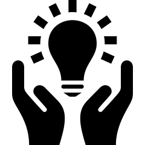

#  Colabora
Este repositorio recoge un listado de proyectos externos relacionados o derivados del uso de los conjuntos de datos del INE. 
Si quieres participar en fomentar la reutilización de la información que publica el INE, te animamos a que compartas con nosotros tu proyecto.
Contacta [aquí](https://www.ine.es/infoine/).

⚠️ **Aviso a usuarios**: Este repositorio reúne proyectos creados por personas externas al INE utilizando datos abiertos o herramientas
que el INE pone a disposición del público con fines informativos y de divulgación. El INE no participa en su
desarrollo y los contenidos son responsabilidad exclusiva de sus autores. Su inclusión en este espacio no implica,
por lo tanto, desarrollo, validación, supervisión ni respaldo por parte del INE, tampoco supone ninguna
responsabilidad por parte del INE en relación con la exactitud de sus contenidos, la disponibilidad y seguridad
de la información, ni con el funcionamiento del proyecto o actualización de sus contenidos. El INE no ostenta
relación jurídica alguna con los responsables de dichos proyectos.El INE declina cualquier responsabilidad relacionada
con el software, herramientas o servicios proporcionados por terceros a los que se acceda a través de enlaces
o referencias incluidos en esta página web. El acceso a dichos recursos externos se realiza bajo la exclusiva
responsabilidad del usuario, quien deberá valorar sus condiciones de uso, licencias, políticas de privacidad
y cualquier otro aspecto relacionado. El INE ha comprobado la validez de los enlaces en el momento de su
inclusión en esta página, si bien no garantiza que los enlaces externos se encuentren operativos, libres de errores,
actualizados o exentos de elementos maliciosos (como malware, virus o páginas fraudulentas). Asimismo,el INE
no asumirá ningún daño, perjuicio o incidencia derivada del uso o descarga de herramientas de terceros, de la
navegación por sitios externos o de la interacción con servicios ajenos a los sistemas propios del INE.

